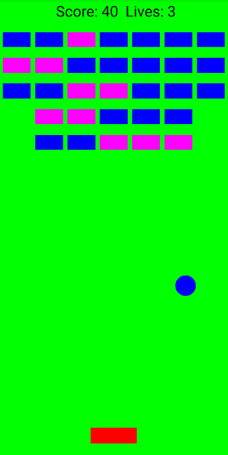

# Breakout game

Made with Android Studio 2024.2.2

Added different bricks types as optinal feature. One brick (the blue one) which is destroyed by one hit and 
another one which is destroyed by two hits (the magenta one).

All game logic and mechanics are written in C++, you can see it in the Logic.cpp file.
Also there are three java classes:
- MainActivity which is the entry point of the app.
- GameThread which handles the game loop.
- Game which handles the input, render and update of the game

  

